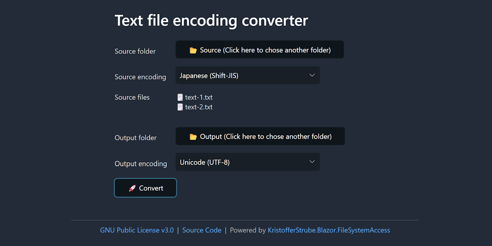

# Text File Encoding Converter

This simple tool converts text file encoding built with Blazor WebAssembly. It is a demo project that shows how to use Blazor WebAssembly to build a simple tool with the File System Access API. The live demo is available at [https://sample-by-jsakamoto.github.io/Blazor-TextFileEncodingConverter/](https://sample-by-jsakamoto.github.io/Blazor-TextFileEncodingConverter/).

This project uses the **"KristofferStrube.Blazor.FileSystemAccess"** NuGet package to utilize the File System Access API. 

https://github.com/KristofferStrube/Blazor.FileSystemAccess

This package provides a simple way to access the File System Access API in Blazor WebAssembly apps.

## License

[GNU General Public License version 3.0](LICENSE)